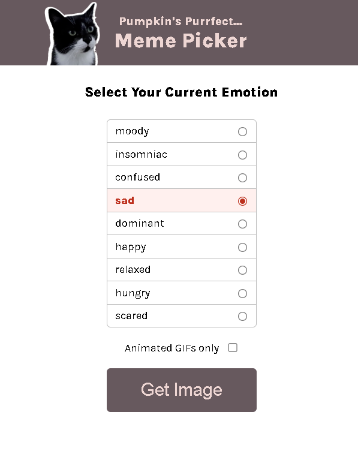
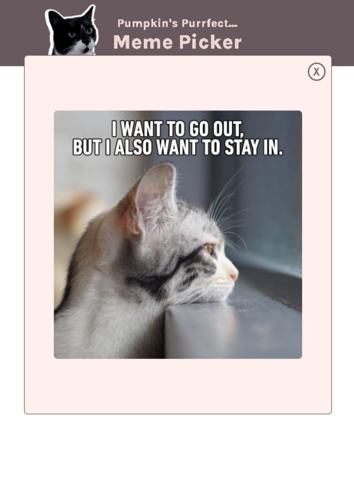
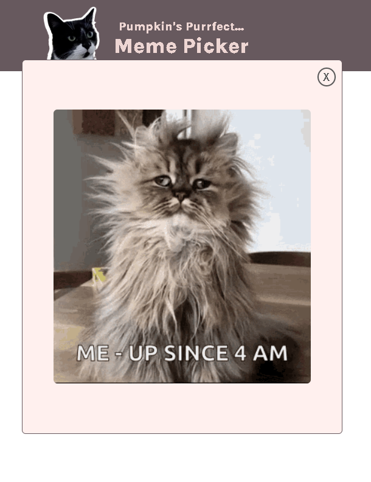

# 🐱 Meme Picker

A fun and interactive web app that lets users select their current emotion and generate a matching cat meme (image or GIF).

---

## 🌐 Live Demo

👉 https://meme-picker-alam.netlify.app

---

## 📸 Screenshots

### 🧠 Emotion Selection UI



### 🖼️ Meme Modal (Image)



### 🎞️ Meme Modal (GIF)



---

## 🚀 Features

* Select emotion using dynamic radio inputs
* Filter results with **GIF-only toggle**
* Random meme generation
* Highlight selected emotion
* Modal popup display
* Close modal functionality

---

## 📁 Project Structure

```id="w7k2bn"
Meme-picker/
│
├── images/
├── screen-recording/
│   └── screen-recording.mp4
├── screenshots/
│   ├── Screenshot-1.png
│   ├── Screenshot-2.png
│   └── Screenshot-3.png
│
├── data.js
├── index.html
├── index.css
├── index.js
└── .gitattributes
```

---

## 🧠 What I Learned

* DOM manipulation to dynamically render UI
* Event handling for interactive user actions
* Filtering data using `.filter()` and `.includes()`
* Applying conditional logic based on user input
* Generating random results dynamically
* Managing UI state with selected inputs
* Updating UI with `classList` for feedback
* Building and controlling a modal component

---

## 📚 Learning Resource

This project was built as part of my learning journey on Scrimba:

👉 https://scrimba.com/?via=u43a7734

---

## 🔗 Connect With Me

* GitHub: https://github.com/ThisisAlam
* LinkedIn: https://www.linkedin.com/in/fakhar-e-alam-a046133b4/

---

## ⭐ Support

If you like this project, consider giving it a star ⭐
